#TAREA EVALUABLE 1.3
## Paso 1
### -El alumnado trabajará por parejas: user1 y user2. Indicar quién es user1 y quién es user2.
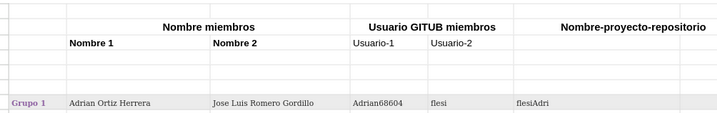
## Paso 2
### -user1 creará un repositorio público llamado git-work en su cuenta de GitHub, añadiendo un README.md y una licencia MIT.
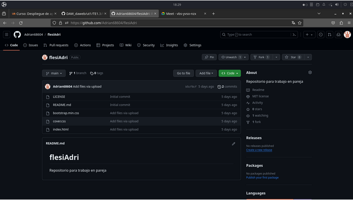
## Paso 3
### -user1 clonará el repo y añadirá los ficheros: index.html, bootstrap.min.css y cover.css. Luego subirá los cambios al upstream.
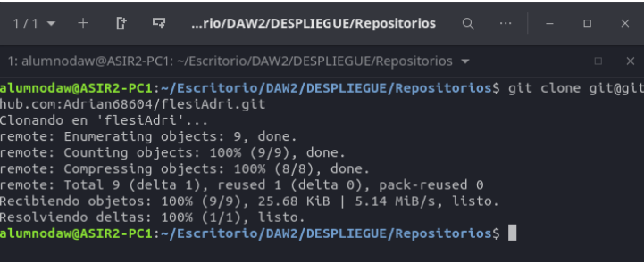
### -Clono con git clone y la url.
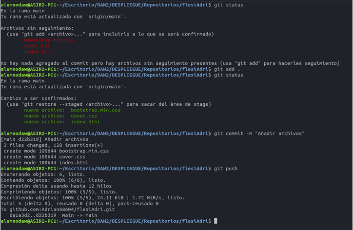
### -git add . Para agregar los archivos , hacemos git commit -m “mensaje” y un git push para subirlo y comprobamos que los archivos están en el repositorio

## Paso 4
### -user2 creará un fork de git-work desde su cuenta de GitHub.
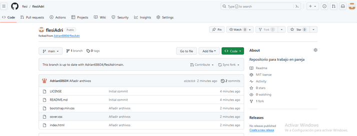
## Paso 5
### -user2 clonará su fork del repo.
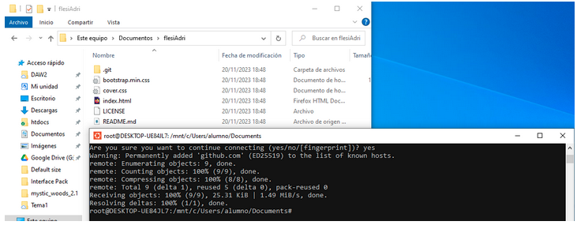
## Paso 6
### -user2 creará una nueva rama custom-text y modificará el fichero index.html personalizándolo para una supuesta startup.
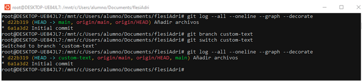
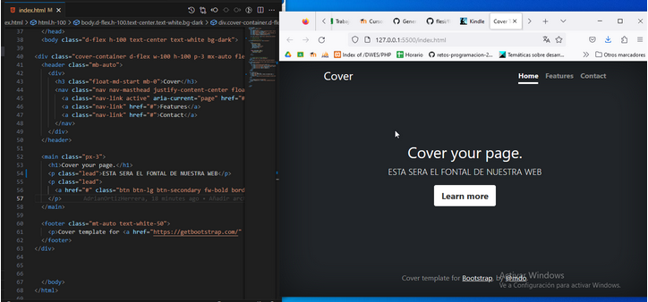

## Paso 7
### -user2 enviará un pull-request (PR) a user1 (marcando Allow edits from maintainers).
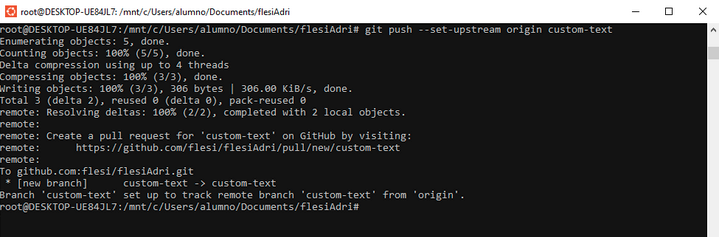
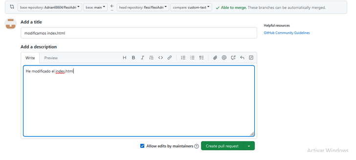
## Paso 8
### -user1 probará el PR de user2 en su máquina (copia local), clonando el repositorio del user2 en un nueva carpeta, posicionándose en la rama custom-text, y realizará ciertos cambios en su copia local que luego deberá subir al propio PR (usando git push a la rama custom-text en remoto).
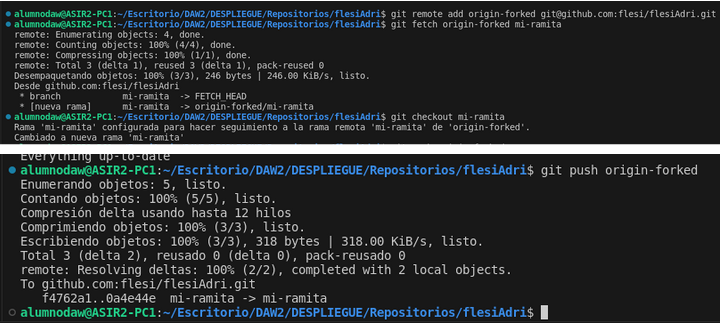
## Paso 9
### -user1 y user2 tendrán una pequeña conversación en la página del PR, donde cada usuario incluirá, al menos, un cambio más.
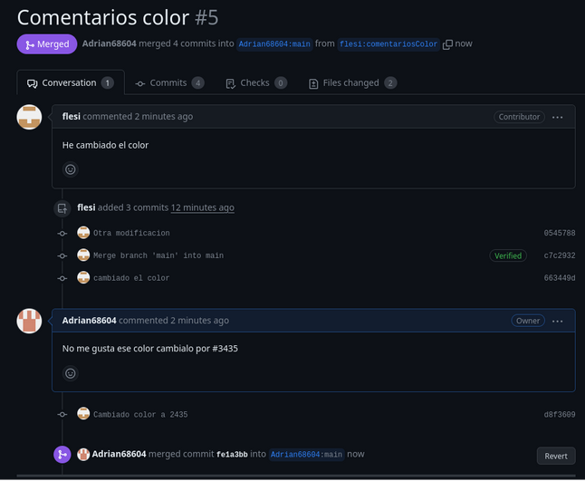
## Paso 10
### -user1 finalmente aprobará el PR.

## Paso 11
### -user1 actualizará la rama principal en su copia local. (git pull origin main)
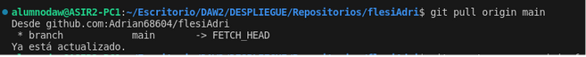
## Paso 12
### -user2 incorporará los cambios del user1 rama main (a través de la interfaz de Github). Ahora, los cambios que envió user2 en el PR, se encuentran en la rama main de user1, y ahora también en la rama main de user2.
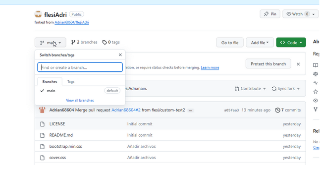
## Paso 13
### -user2 deberá actualizar su copia local desde remoto en su rama main. (git pull origin)
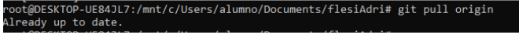
## Paso 14
### -user2 eliminará la rama custom-text de su repositorio local y remoto.
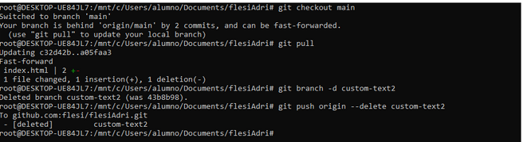